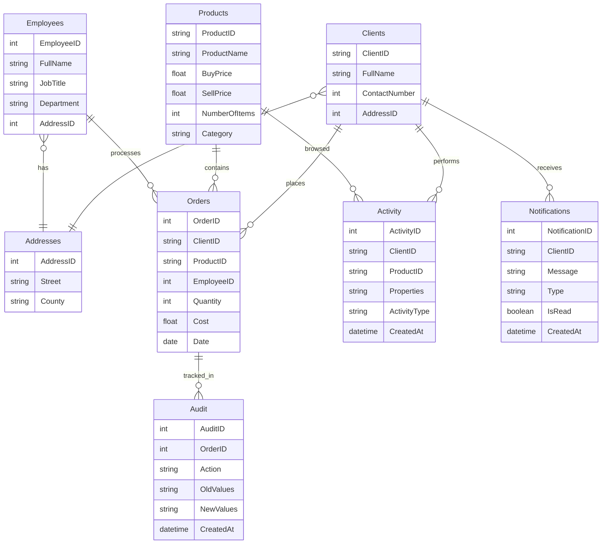

# retail-analytics-sql

**Advanced MySQL-based retail analytics platform.**  
Implements stored routines, optimized queries, JSON parsing, triggers, and common table expressions (CTEs) to support business performance tracking, audit automation, and customer activity analysis across multiple entities.

---

## 🚀 Features

### Schema & Data
- Comprehensive retail schema with **Clients, Orders, Products, Employees, Addresses, Activity, Audit, and Notifications**.
- Seed data with clients, employees, products, orders, activities, and notifications for realistic testing.

### Stored Routines
- `FindAverageCost` – calculates product cost averages
- `GetProfit` – calculates profit at product or global level
- `EvaluateProduct` – returns sales, revenue, stock health, and performance category
- `GetCustomerSummary` – detailed purchase & activity summary for a client
- `GenerateInventoryReport` – insights into stock levels, profitability, and alerts

### Triggers
- Full audit trail for **INSERT/UPDATE/DELETE** on Orders
- Inventory auto-updates and low-stock alerts
- Cost validation before inserts, activity-driven promotions, and marketing nudges


## 🗂️ Repository Structure

```text
/docs/               # ERD diagrams, benchmarks, architecture notes
/sql/                # schema, seed data, stored routines, triggers, CTE queries, indexes, events
/tests/              # SQL-based unit tests (GetProfit, FindAverageCost, commissions, etc.)
/docker/             # Docker Compose and MySQL configuration (mysql.cnf, init scripts)
/                    # README.md, LICENSE, .gitattributes, .env.example
```

## 📊 Entity Relationship Diagram

### Mermaid (editable)


⚙️ Setup & Usage
1. Clone the repository
```bash
git clone https://github.com/YOUR_USER/retail_analytics-sql.git
cd retail_analytics-sql
```
2. Run with Docker
```bash
cd docker
docker-compose up -d
```
MySQL will start on port 3306, with schema + sample data initialized.
3. Connect to MySQL
```bash
mysql -h 127.0.0.1 -P 3306 -u app -p
```


