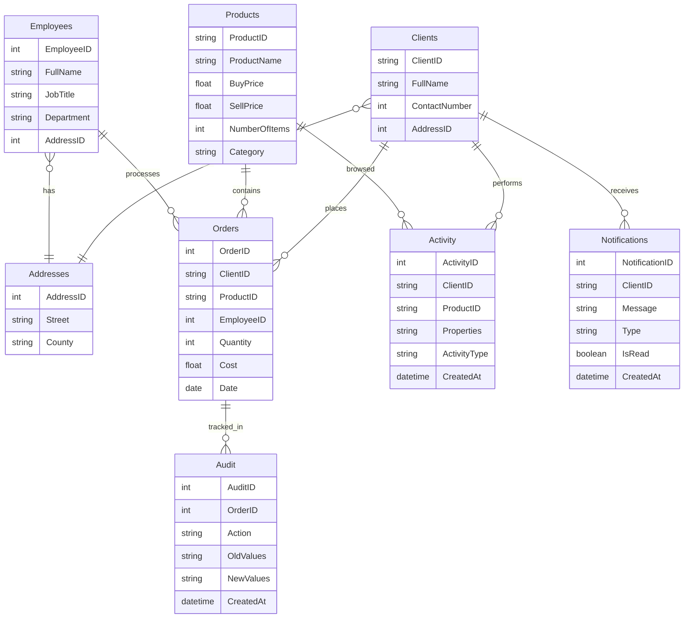

# retail-analytics-sql-
Advanced MySQL-based retail analytics platform. Implements stored routines, optimized queries, JSON parsing, triggers, and common table expressions (CTEs) to support business performance tracking, audit automation, and customer activity analysis across multiple entities.

## 🚀 Features
- **Schema & Data**
  - Comprehensive retail schema with **Clients, Orders, Products, Employees, Addresses, Activity, Audit, and Notifications**:contentReference[oaicite:0]{index=0}.
  - Seed data with clients, employees, products, orders, activities, and notifications for realistic testing:contentReference[oaicite:1]{index=1}.
- **Stored Routines**
  - `FindAverageCost` – calculates product cost averages:contentReference[oaicite:2]{index=2}.
  - `GetProfit` – calculates profit at product or global level:contentReference[oaicite:3]{index=3}.
  - `EvaluateProduct` – returns sales, revenue, stock health, and performance category:contentReference[oaicite:4]{index=4}.
  - `GetCustomerSummary` – detailed purchase & activity summary for a client:contentReference[oaicite:5]{index=5}.
  - `GenerateInventoryReport` – insights into stock levels, profitability, and alerts:contentReference[oaicite:6]{index=6}.
- **Triggers**
  - Full audit trail for **INSERT/UPDATE/DELETE** on Orders:contentReference[oaicite:7]{index=7}.
  - Inventory auto-updates and low-stock alerts:contentReference[oaicite:8]{index=8}.
  - Cost validation before inserts, activity-driven promotions, and marketing nudges:contentReference[oaicite:9]{index=9}.
- **Queries (CTEs)**
  - Customer segmentation (high vs low value):contentReference[oaicite:10]{index=10}.
  - Monthly sales with running totals and growth rate:contentReference[oaicite:11]{index=11}.
  - Product performance ranking by revenue/profit:contentReference[oaicite:12]{index=12}.
  - Customer journey analysis (lifespan, order gaps, lifetime value):contentReference[oaicite:13]{index=13}.
  - Activity + JSON analytics (conversion rates, engagement trends):contentReference[oaicite:14]{index=14}.
- **Indexes**
  - Optimized composite indexes for Orders, Products, Clients, Employees, Audit, and Notifications:contentReference[oaicite:15]{index=15}.
  - Maintenance recommendations (weekly, monthly, quarterly checks):contentReference[oaicite:16]{index=16}.
- **Event Scheduler**
  - Daily inventory check, weekly sales summaries, monthly cleanup, daily performance monitor, and weekly customer re-engagement campaigns:contentReference[oaicite:17]{index=17}.
- **Testing**
  - Automated suite for functions & procedures (profit, cost, evaluation, commissions):contentReference[oaicite:18]{index=18}.
  - Performance & data integrity tests with results stored in `test_results`:contentReference[oaicite:19]{index=19}.
---

## 🗂️ Repository Structure
/docs/ # ERD, benchmarks, architecture notes
/sql/ # schema, seed data, routines, triggers, CTE queries, indexes, events
/tests/ # SQL-based unit tests (GetProfit, FindAverageCost, etc.)
/docker/ # Docker Compose and MySQL config for easy setup
---

## 📊 Entity Relationship Diagram

### Mermaid (editable)


⚙️ Setup & Usage
1. Clone the repository
```bash
git clone https://github.com/YOUR_USER/retail_analytics-sql.git
cd retail_analytics-sql
```
2. Run with Docker
```bash
cd docker
docker-compose up -d
```
MySQL will start on port 3306, with schema + sample data initialized.
3. Connect to MySQL
```bash
mysql -h 127.0.0.1 -P 3306 -u app -p
```


