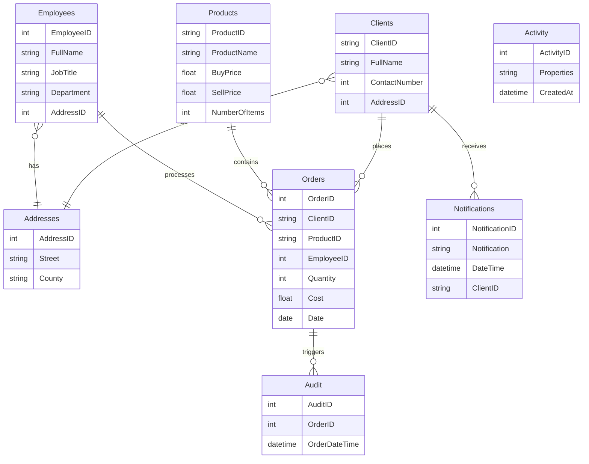

# retail-analytics-sql-
Advanced MySQL-based retail analytics platform. Implements stored routines, optimized queries, JSON parsing, triggers, and common table expressions (CTEs) to support business performance tracking, audit automation, and customer activity analysis across multiple entities.

